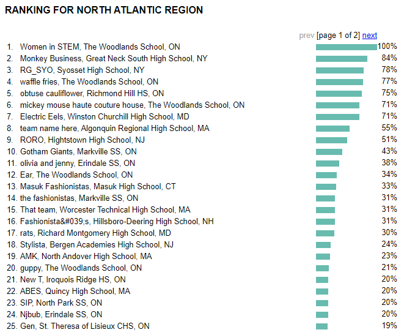

# DECA VBC percentage extension

Displays the percentage of each team in the DECA VBC standings relative to the top team.

## Installation

### Chrome

To install this extension locally, simply follow the instructions from [Google](https://developer.chrome.com/docs/extensions/get-started/tutorial/hello-world#load-unpacked).

Download the files and load them at ```chrome://extensions``` using the above tutorial.

### Firefox

The extension is publically listened [here](https://addons.mozilla.org/en-CA/firefox/addon/deca-vbc-standings-percentage/).

## Demo


